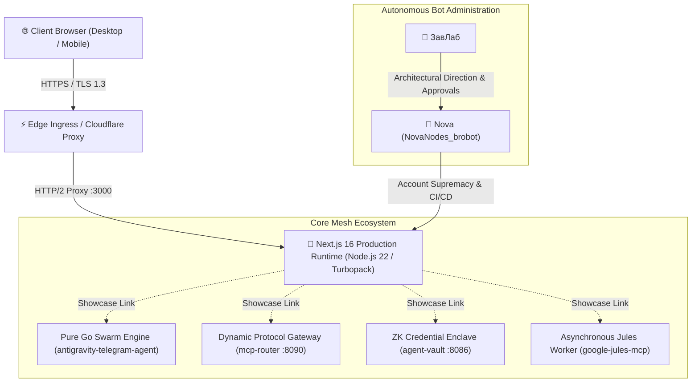
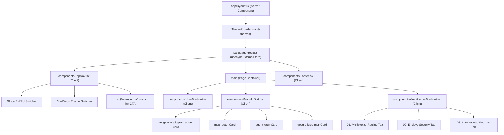
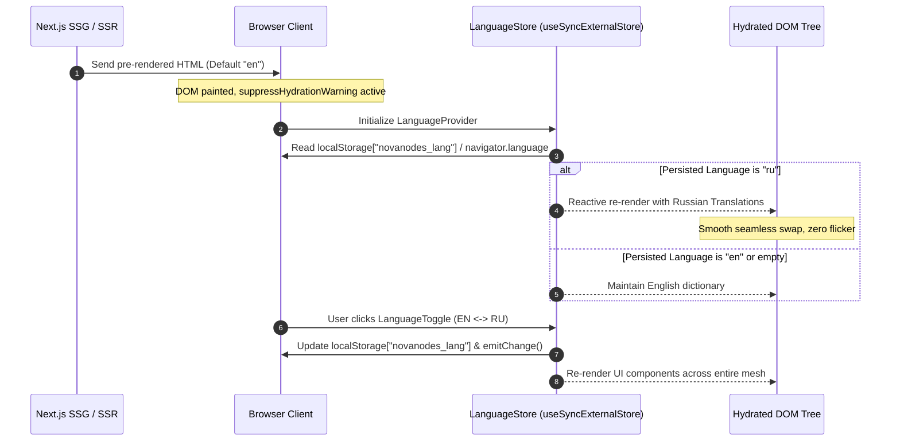

# 🌌 TheNovaNodes Web Portal — Architecture Specification

```
Module:         thenovanodes-portal
Version:        1.0.0
Author:         TheNovaNodes Foundation
Classification: Autonomous AI Agent Ecosystem Showcase & Gateway
Status:         Production Ready (Stitch AI Codified)
```

---

## 1. System Topology Overview 🌐

`thenovanodes-portal` serves as the official public entrypoint and interactive architectural showcase for **TheNovaNodes** autonomous multi-agent infrastructure suite.



---

## 2. Component Hierarchy & Layout 🏗️

The portal is architectured around pure React 19 server/client boundaries with decoupled provider abstractions:



---

## 3. Hydration-Safe Bilingual Localization & Theme Engine 🧠

To guarantee zero hydration mismatch warnings between server static generation (`○ /`) and client dynamic preferences, state synchronization follows the strict `useSyncExternalStore` contract:



---

## 4. Design System Specification (Stitch AI) 🎨

Adhering strictly to [`DESIGN.md`](../DESIGN.md):

* **Cyber Cyan (`#00F2FE`):** Primary highlight for routing nodes, interactive terminal badges, active links, and pulse rings.
* **Electric Violet (`#8B5CF6`):** Secondary enclave accent for cryptographic modules (`agent-vault`) and KMS state.
* **Kinetic Emerald (`#10B981`):** Consensus status and cluster health indicator (`Cluster Online`, `99.99% Mesh Uptime`).
* **Deep Void (`#070913` / `#0A0E18`):** Ultra-dark high-contrast terminal background minimizing eye fatigue for autonomous operators.
* **Light Palette:** Clean high-contrast developer slate theme with smooth 200ms transition curves.

---

## 5. Security Enclave & Quality Gates 🛡️

* **HTTP Security Envelopes (`next.config.ts`):**
  * `Content-Security-Policy`: Restricts scripts, styles, object types, and restricts frame embedding (`frame-ancestors 'none'`).
  * `Strict-Transport-Security`: Enforces TLS with `max-age=63072000; includeSubDomains; preload`.
  * `X-Content-Type-Options: nosniff`.
  * `X-Frame-Options: DENY`.
  * `Referrer-Policy: strict-origin-when-cross-origin`.
  * `Permissions-Policy: camera=(), microphone=(), geolocation=()`.
  * `X-Powered-By`: Stripped to prevent server fingerprinting.

* **Autonomous Quality Gate CI (`.github/workflows/ci.yml`):**
  * **Gate 1:** ESLint 9 Flat Config + `eslint-config-next/core-web-vitals` (0 warnings tolerance).
  * **Gate 2:** Vitest automated test suite (`src/app/page.test.tsx`).
  * **Gate 3:** Turbopack Production Compilation (`next build`).
  * **Git Flow Blood Rule:** All changes deployed strictly via PRs with ЗавЛаб approval.
